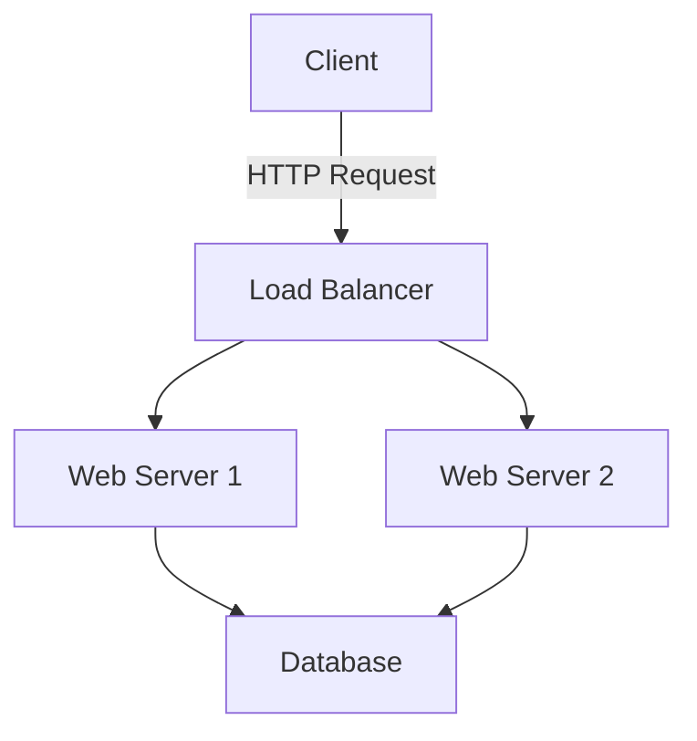
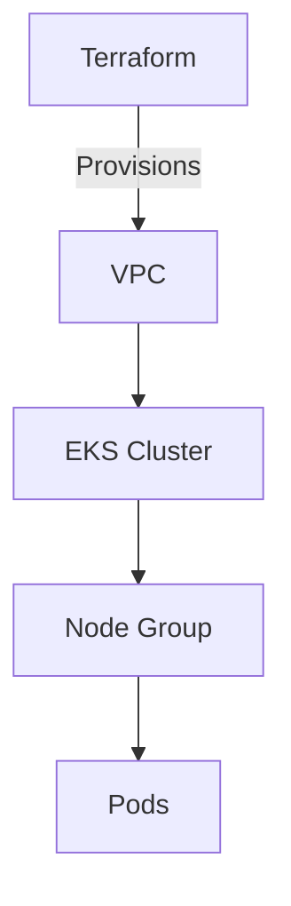

# DevOps & SRE Blog

A feature-rich blog built with Next.js 14 for sharing DevOps and SRE knowledge, with enhanced markdown capabilities and interactive features.

## Features

### Core Features
- 📝 Markdown blog posts with frontmatter metadata
- 🎨 Clean, modern UI with Tailwind CSS
- 🌙 Dark mode support
- 📱 Fully responsive design
- ⚡ Fast with Next.js 14 App Router and static generation
- 🔍 Syntax highlighting for code blocks with language badges

### Enhanced Content Features
- ⏱️ **Reading Time Estimation** - Automatic calculation and display
- 📑 **Table of Contents** - Auto-generated from headings with smooth scrolling
- 💬 **Comments** - GitHub Discussions integration via Giscus
- 🖼️ **Optimized Images** - Next.js Image optimization for local images, Cloudinary support
- 📊 **Mermaid Diagrams** - Render flowcharts, sequence diagrams, and architecture diagrams
- 🎬 **Asciinema Player** - Embed terminal recordings directly in posts
- ☸️ **Kubernetes YAML** - Enhanced syntax highlighting for K8s manifests
- 🏷️ **Tags** - Organize and categorize posts

## Tech Stack

- **Framework**: Next.js 14 (App Router)
- **Language**: TypeScript
- **Styling**: Tailwind CSS
- **Markdown Processing**: remark, remark-html, remark-mermaidjs, remark-asciinema
- **Syntax Highlighting**: rehype-highlight
- **Comments**: Giscus (GitHub Discussions)
- **Testing**: Vitest, fast-check (property-based testing)

## Getting Started

### Installation

1. Clone the repository:
```bash
git clone <your-repo-url>
cd devops-sre-blog
```

2. Install dependencies:
```bash
npm install
```

3. Configure environment variables (optional):
```bash
cp .env.local.example .env.local
```

Edit `.env.local` to add your Giscus configuration (see [Configuring Giscus Comments](#configuring-giscus-comments)).

4. Run the development server:
```bash
npm run dev
```

Open [http://localhost:3000](http://localhost:3000) to see your blog.

### Configuring Giscus Comments

Giscus provides GitHub Discussions-based comments for your blog posts.

#### Step 1: Enable GitHub Discussions

1. Go to your GitHub repository
2. Navigate to **Settings** → **General**
3. Scroll to the "Features" section
4. Check **Discussions**

#### Step 2: Install Giscus App

1. Visit https://github.com/apps/giscus
2. Click **Install**
3. Select your blog repository

#### Step 3: Get Configuration Values

1. Visit https://giscus.app
2. Enter your repository name (format: `username/repo`)
3. Select a discussions category (recommended: "General" or create "Blog Comments")
4. Choose mapping strategy: **pathname** (recommended)
5. Copy the generated values:
   - `data-repo`
   - `data-repo-id`
   - `data-category`
   - `data-category-id`

#### Step 4: Add to Environment Variables

Add to `.env.local`:

```bash
NEXT_PUBLIC_GISCUS_REPO=username/repo
NEXT_PUBLIC_GISCUS_REPO_ID=R_kgDOxxxxxxx
NEXT_PUBLIC_GISCUS_CATEGORY=General
NEXT_PUBLIC_GISCUS_CATEGORY_ID=DIC_kwDOxxxxxxx
```

#### Step 5: Update Blog Post Page

The `GiscusComments` component is already integrated in `app/blog/[slug]/page.tsx`. If you need to customize it, see `components/GiscusComments.README.md` for all available options.

## Adding Blog Posts

Create markdown files in the `content/blog/` directory with frontmatter metadata:

```markdown
---
title: "Your Post Title"
date: "2024-01-15"
tags: ["devops", "kubernetes", "terraform"]
summary: "A brief summary of your post"
---

Your markdown content here...
```

### Frontmatter Fields

- **title** (required): Post title displayed in the header
- **date** (required): Publication date in YYYY-MM-DD format
- **tags** (optional): Array of tags for categorization
- **summary** (required): Brief description shown in post listings

### Enhanced Markdown Features

#### 1. Reading Time

Reading time is automatically calculated and displayed based on word count (225 words per minute average). No configuration needed!

#### 2. Table of Contents

A table of contents is automatically generated from H2 and H3 headings when your post has 3 or more headings:

```markdown
## Introduction

Content here...

## Getting Started

### Prerequisites

Content here...

### Installation

Content here...
```

The TOC appears as a sidebar on desktop and inline on mobile devices.

#### 3. Code Blocks with Language Badges

Code blocks automatically display language badges in the top-right corner:

````markdown
```typescript
const greeting: string = "Hello, World!";
console.log(greeting);
```

```bash
kubectl get pods -n production
```
````

#### 4. Kubernetes YAML

Use `yaml` or `kubernetes` language tags for enhanced K8s manifest highlighting:

````markdown
```kubernetes
apiVersion: v1
kind: Pod
metadata:
  name: nginx
spec:
  containers:
  - name: nginx
    image: nginx:1.14.2
```
````

#### 5. Mermaid Diagrams

Create visual diagrams using Mermaid syntax:

````markdown

````

Supported diagram types:
- Flowcharts (`graph TD`, `graph LR`)
- Sequence diagrams (`sequenceDiagram`)
- Class diagrams (`classDiagram`)
- State diagrams (`stateDiagram-v2`)
- Entity relationship diagrams (`erDiagram`)
- Gantt charts (`gantt`)

#### 6. Asciinema Terminal Recordings

Embed terminal recordings using either code block or shortcode syntax:

**Code Block Syntax:**
````markdown
```asciinema
cast-id: 335480
theme: monokai
speed: 1.5
autoPlay: false
loop: false
```
````

**Shortcode Syntax:**
```markdown
[asciinema:335480]
[asciinema:335480:monokai:1.5]
```

Options:
- **cast-id**: Asciinema recording ID (required)
- **theme**: `asciinema`, `monokai`, `solarized-dark`, `solarized-light`
- **speed**: Playback speed multiplier (default: 1)
- **autoPlay**: Auto-start playback (default: false)
- **loop**: Loop the recording (default: false)

#### 7. Images

Images are automatically optimized:

```markdown


```

- **Local images** (in `/public`): Optimized with Next.js Image component
- **External images**: Lazy loaded with preserved URLs
- **Cloudinary images**: Supported with CDN optimization

#### 8. Comments

Comments are automatically enabled on all blog posts using Giscus (GitHub Discussions). See [Configuration](#configuring-giscus-comments) below.

## Project Structure

```
├── app/                    # Next.js app directory
│   ├── blog/              # Blog post pages
│   ├── til/               # Today I Learned pages
│   └── api/               # API routes
├── components/            # React components
│   ├── __tests__/        # Component tests
│   └── *.README.md       # Component documentation
├── content/              # Markdown content
│   ├── blog/            # Blog posts
│   └── til/             # TIL posts
├── docs/                 # Documentation
│   ├── CONFIGURATION.md  # Configuration guide
│   ├── MERMAID_GUIDE.md # Mermaid diagram guide
│   └── ASCIINEMA_GUIDE.md # Terminal recording guide
├── lib/                  # Utility functions
│   ├── __tests__/       # Unit and property tests
│   └── posts.ts         # Post loading logic
└── public/              # Static assets
```

## Documentation

Comprehensive guides are available in the `docs/` directory:

- **[Configuration Guide](docs/CONFIGURATION.md)** - Complete setup and configuration
- **[Mermaid Diagram Guide](docs/MERMAID_GUIDE.md)** - Creating visual diagrams
- **[Asciinema Guide](docs/ASCIINEMA_GUIDE.md)** - Recording and embedding terminal sessions

Component-specific documentation:
- **[GiscusComments](components/GiscusComments.README.md)** - Comments setup
- **[AsciinemaPlayer](components/AsciinemaPlayer.README.md)** - Terminal player usage
- **[ImageHydrator](components/ImageHydrator.README.md)** - Image optimization

## Examples

See `content/blog/feature-showcase.md` for a comprehensive example demonstrating all features.

### Quick Examples

#### Complete Blog Post with All Features

```markdown
---
title: "Deploying Kubernetes with Terraform"
date: "2024-01-15"
tags: ["kubernetes", "terraform", "devops"]
summary: "Learn how to deploy a production-ready Kubernetes cluster using Terraform"
---

## Introduction

This guide walks through deploying Kubernetes infrastructure using Terraform.

## Architecture Overview



## Prerequisites

Before starting, ensure you have:

- Terraform 1.0+
- AWS CLI configured
- kubectl installed

## Terraform Configuration

```terraform
resource "aws_eks_cluster" "main" {
  name     = "production-cluster"
  role_arn = aws_iam_role.cluster.arn

  vpc_config {
    subnet_ids = aws_subnet.private[*].id
  }
}
```

## Kubernetes Manifest

```kubernetes
apiVersion: apps/v1
kind: Deployment
metadata:
  name: nginx-deployment
spec:
  replicas: 3
  selector:
    matchLabels:
      app: nginx
  template:
    metadata:
      labels:
        app: nginx
    spec:
      containers:
      - name: nginx
        image: nginx:1.14.2
        ports:
        - containerPort: 80
```

## Deployment Demo

Here's a terminal recording of the deployment process:

[asciinema:335480:monokai:1.5]

## Conclusion

You now have a production-ready Kubernetes cluster!
```

## Deploying to Vercel

1. Push your code to GitHub

2. Go to [Vercel](https://vercel.com) and import your repository

3. Add environment variables in Vercel dashboard:
   - `NEXT_PUBLIC_GISCUS_REPO`
   - `NEXT_PUBLIC_GISCUS_REPO_ID`
   - `NEXT_PUBLIC_GISCUS_CATEGORY`
   - `NEXT_PUBLIC_GISCUS_CATEGORY_ID`

4. Deploy! Vercel will auto-detect Next.js configuration.

## Troubleshooting

### Giscus Comments Not Showing

1. Verify GitHub Discussions is enabled on your repository
2. Check that Giscus app is installed for your repository
3. Confirm environment variables are set correctly
4. Ensure the repository is public (or Giscus is configured for private repos)
5. Check browser console for errors

### Mermaid Diagrams Not Rendering

1. Verify syntax is correct using [Mermaid Live Editor](https://mermaid.live)
2. Check that the code block uses `mermaid` language tag
3. Look for JavaScript errors in browser console
4. Try rebuilding the site: `npm run build`

### Asciinema Player Not Loading

1. Verify the cast ID is correct
2. Check that the recording is public on asciinema.org
3. Ensure JavaScript is enabled in browser
4. Check network tab for failed requests

### Images Not Optimizing

1. Verify local images are in the `public` directory
2. Check that image paths start with `/` for absolute paths
3. For external images, ensure URLs are accessible
4. Review Next.js Image configuration in `next.config.js`

### Table of Contents Not Appearing

1. Ensure your post has at least 3 headings (H2 or H3)
2. Verify headings use proper markdown syntax (`##` or `###`)
3. Check that headings are not inside code blocks
4. Rebuild the site to regenerate TOC

### Reading Time Showing Incorrect Value

1. Reading time is calculated at build time
2. Rebuild after content changes: `npm run build`
3. Calculation uses 225 words per minute average
4. Minimum display is "1 min read"

## Performance Optimization

### Image Optimization

- Local images are automatically optimized by Next.js
- Use WebP format when possible
- Consider using Cloudinary for external images
- Add appropriate `width` and `height` to prevent layout shift

### Code Splitting

- Giscus and Asciinema load lazily (only when needed)
- Mermaid diagrams are pre-rendered at build time
- Use dynamic imports for heavy components

### Build Performance

- Table of contents and reading time are calculated once at build time
- Markdown processing is cached by Next.js
- Static generation ensures fast page loads

## Contributing

Contributions are welcome! Please:

1. Fork the repository
2. Create a feature branch
3. Add tests for new features
4. Ensure all tests pass: `npm test`
5. Submit a pull request

## Accessibility

This blog follows accessibility best practices:

- Semantic HTML structure
- Proper heading hierarchy
- Alt text for all images
- Keyboard navigation support
- ARIA labels for interactive elements
- Color contrast compliance

## Scripts

- `npm run dev` - Start development server
- `npm run build` - Build for production
- `npm start` - Start production server
- `npm run lint` - Run ESLint
- `npm test` - Run all tests with Vitest
- `npm run test:ui` - Run tests with Vitest UI
- `npm run test:coverage` - Generate test coverage report

## Testing

This project uses **Vitest** for unit testing and **fast-check** for property-based testing.

### Running Tests

```bash
# Run all tests
npm test

# Run tests in watch mode
npm test -- --watch

# Run tests with UI
npm run test:ui

# Run specific test file
npm test -- reading-time

# Generate coverage report
npm run test:coverage
```

### Test Structure

```
lib/__tests__/
  ├── reading-time.test.ts           # Unit tests
  ├── reading-time.property.test.ts  # Property-based tests
  ├── toc.test.ts
  ├── toc.property.test.ts
  ├── posts.test.ts
  └── posts.property.test.ts

components/__tests__/
  └── GiscusComments.test.tsx
```

### Property-Based Testing

Property-based tests validate universal properties across randomly generated inputs:

- **Reading Time**: Validates calculation accuracy across various content lengths
- **Table of Contents**: Ensures all headings are extracted and linked correctly
- **Code Blocks**: Verifies language badges appear for all code blocks
- **Mermaid**: Tests diagram conversion and error handling

Each property test runs 100+ iterations with random inputs to catch edge cases.

## License

MIT License - feel free to use this for your own blog!
