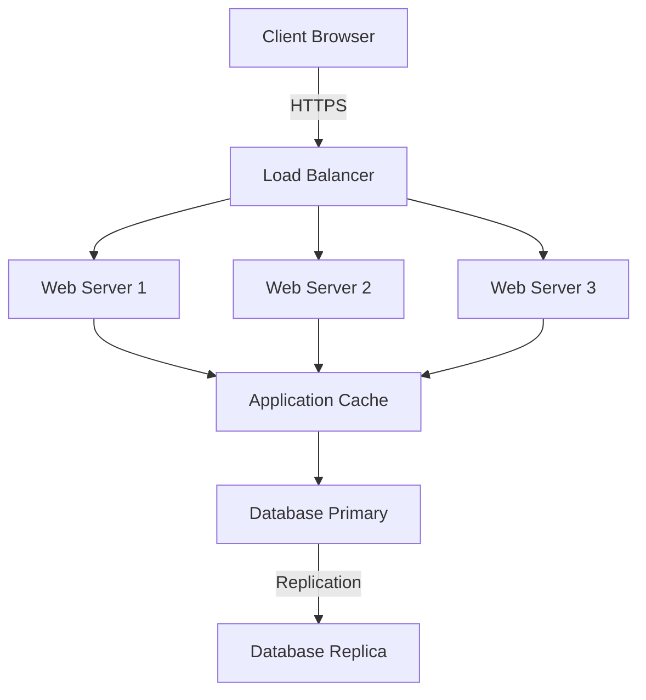
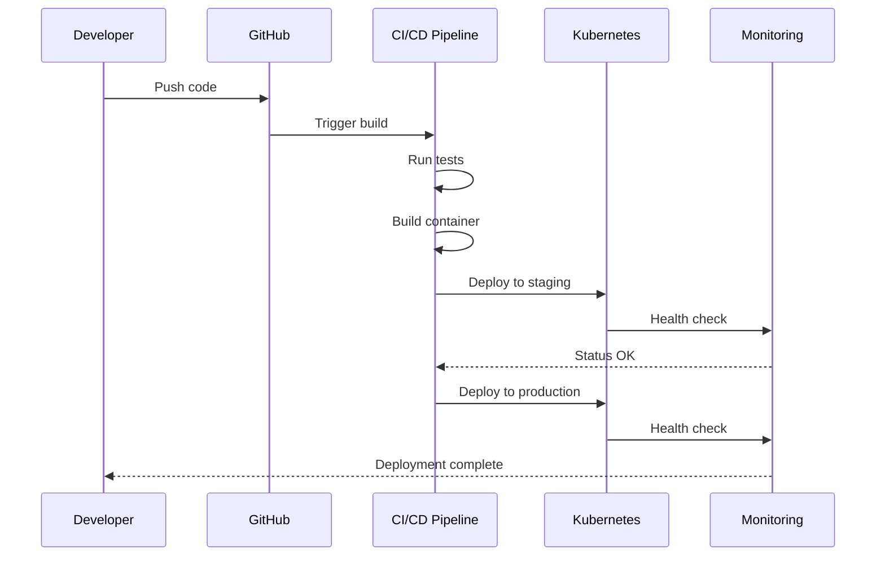
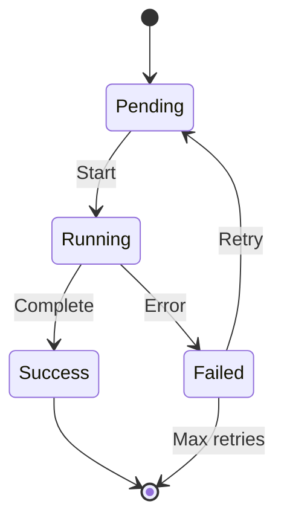
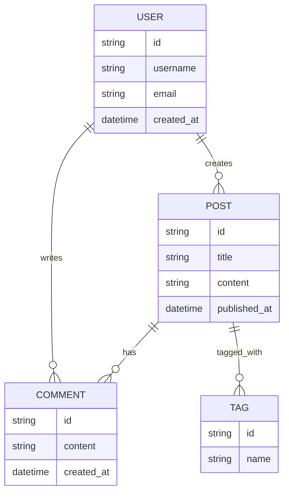
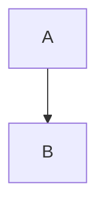

## Introduction

Welcome to the complete feature showcase for this DevOps & SRE blog! This post demonstrates every enhanced feature available for content authors. You'll see reading time estimation, an auto-generated table of contents, Mermaid diagrams, Asciinema terminal recordings, enhanced code blocks, and GitHub Discussions-based comments.

This post is designed to serve as both a reference and a template for creating rich, technical content.

## Reading Time Estimation

Notice the reading time displayed at the top of this post? It's automatically calculated based on the word count using an average reading speed of 225 words per minute. This helps readers decide whether they have time to read the full article or should bookmark it for later.

The calculation:
- Strips all markdown syntax and HTML tags
- Counts words in plain text
- Divides by 225 words per minute
- Displays minimum of "1 min read"

No configuration needed—it just works!

## Table of Contents

The table of contents you see (on desktop as a sidebar, on mobile inline above) is automatically generated from all H2 and H3 headings in this post. It only appears when there are 3 or more headings, making it perfect for longer technical articles.

Features:
- Smooth scrolling to sections
- Hierarchical structure (H3 indented under H2)
- Responsive design
- Auto-generated anchor links

## Mermaid Diagrams

Mermaid allows you to create visual diagrams using simple text syntax. Here are examples of different diagram types:

### Architecture Diagram



### Deployment Sequence



### State Machine



### Entity Relationship Diagram



## Code Blocks with Language Badges

All code blocks automatically display language badges in the top-right corner. The copy button is also available for easy copying.

### TypeScript Example

```typescript
interface BlogPost {
  title: string;
  date: string;
  tags: string[];
  summary: string;
  content: string;
}

async function getPost(slug: string): Promise<BlogPost> {
  const filePath = path.join(process.cwd(), 'content/blog', `${slug}.md`);
  const fileContents = await fs.readFile(filePath, 'utf8');
  
  const { data, content } = matter(fileContents);
  
  return {
    ...data,
    content,
  } as BlogPost;
}
```

### Python Script

```python
import subprocess
import sys
from typing import List, Dict

def deploy_to_kubernetes(manifest: str, namespace: str = "default") -> bool:
    """
    Deploy a Kubernetes manifest to the specified namespace.
    
    Args:
        manifest: Path to the Kubernetes manifest file
        namespace: Target namespace (default: "default")
    
    Returns:
        True if deployment successful, False otherwise
    """
    try:
        result = subprocess.run(
            ["kubectl", "apply", "-f", manifest, "-n", namespace],
            capture_output=True,
            text=True,
            check=True
        )
        print(f"Deployment successful: {result.stdout}")
        return True
    except subprocess.CalledProcessError as e:
        print(f"Deployment failed: {e.stderr}", file=sys.stderr)
        return False

if __name__ == "__main__":
    deploy_to_kubernetes("deployment.yaml", "production")
```

### Bash Script

```bash
#!/bin/bash
set -euo pipefail

# Deploy application to Kubernetes cluster
NAMESPACE="${NAMESPACE:-production}"
MANIFEST="${1:-deployment.yaml}"

echo "Deploying to namespace: $NAMESPACE"

# Validate manifest
kubectl apply --dry-run=client -f "$MANIFEST"

# Apply manifest
kubectl apply -f "$MANIFEST" -n "$NAMESPACE"

# Wait for rollout
kubectl rollout status deployment/app -n "$NAMESPACE" --timeout=5m

# Verify deployment
kubectl get pods -n "$NAMESPACE" -l app=myapp

echo "Deployment complete!"
```

### Terraform Configuration

```terraform
terraform {
  required_version = ">= 1.0"
  
  required_providers {
    aws = {
      source  = "hashicorp/aws"
      version = "~> 5.0"
    }
  }
  
  backend "s3" {
    bucket = "terraform-state-bucket"
    key    = "production/terraform.tfstate"
    region = "us-east-1"
  }
}

provider "aws" {
  region = var.aws_region
  
  default_tags {
    tags = {
      Environment = var.environment
      ManagedBy   = "Terraform"
      Project     = "DevOps Blog"
    }
  }
}

resource "aws_eks_cluster" "main" {
  name     = "${var.environment}-cluster"
  role_arn = aws_iam_role.cluster.arn
  version  = "1.28"

  vpc_config {
    subnet_ids              = aws_subnet.private[*].id
    endpoint_private_access = true
    endpoint_public_access  = true
  }

  enabled_cluster_log_types = [
    "api",
    "audit",
    "authenticator",
    "controllerManager",
    "scheduler"
  ]

  depends_on = [
    aws_iam_role_policy_attachment.cluster_policy,
    aws_iam_role_policy_attachment.vpc_resource_controller,
  ]
}
```

## Kubernetes YAML Manifests

Kubernetes manifests get special treatment with enhanced syntax highlighting:

```kubernetes
apiVersion: apps/v1
kind: Deployment
metadata:
  name: nginx-deployment
  namespace: production
  labels:
    app: nginx
    environment: production
  annotations:
    kubernetes.io/change-cause: "Update to nginx 1.25"
spec:
  replicas: 3
  strategy:
    type: RollingUpdate
    rollingUpdate:
      maxSurge: 1
      maxUnavailable: 1
  selector:
    matchLabels:
      app: nginx
  template:
    metadata:
      labels:
        app: nginx
        version: "1.25"
    spec:
      containers:
      - name: nginx
        image: nginx:1.25.3
        ports:
        - containerPort: 80
          name: http
          protocol: TCP
        resources:
          requests:
            memory: "64Mi"
            cpu: "250m"
          limits:
            memory: "128Mi"
            cpu: "500m"
        livenessProbe:
          httpGet:
            path: /healthz
            port: 80
          initialDelaySeconds: 30
          periodSeconds: 10
        readinessProbe:
          httpGet:
            path: /ready
            port: 80
          initialDelaySeconds: 5
          periodSeconds: 5
        env:
        - name: ENVIRONMENT
          value: "production"
        - name: LOG_LEVEL
          value: "info"
---
apiVersion: v1
kind: Service
metadata:
  name: nginx-service
  namespace: production
spec:
  type: LoadBalancer
  selector:
    app: nginx
  ports:
  - protocol: TCP
    port: 80
    targetPort: 80
    name: http
---
apiVersion: autoscaling/v2
kind: HorizontalPodAutoscaler
metadata:
  name: nginx-hpa
  namespace: production
spec:
  scaleTargetRef:
    apiVersion: apps/v1
    kind: Deployment
    name: nginx-deployment
  minReplicas: 3
  maxReplicas: 10
  metrics:
  - type: Resource
    resource:
      name: cpu
      target:
        type: Utilization
        averageUtilization: 70
  - type: Resource
    resource:
      name: memory
      target:
        type: Utilization
        averageUtilization: 80
```

## Asciinema Terminal Recordings

Embed terminal recordings to show real command-line workflows. 

<!-- Shortcode syntax example (commented out):
[asciinema:335480]
-->

You can use the code block syntax for more control:

```asciinema
cast-id: 335480
theme: monokai
speed: 1.5
autoPlay: false
loop: false
```

The player includes:
- Play/pause controls
- Speed adjustment
- Full-screen mode
- Copy text from terminal
- Keyboard shortcuts

## Images and Media

Images are automatically optimized based on their source:

### Local Images

Local images (stored in `/public`) are optimized using Next.js Image component:


### External Images

External images are lazy-loaded with preserved URLs:


### Cloudinary Images

Cloudinary URLs are supported for CDN-optimized images:


All images include:
- Alt text for accessibility
- Lazy loading for performance
- Responsive sizing
- Proper aspect ratios

## Code Without Language

Code blocks without a specified language show a generic "code" badge:

```
# This is a generic code block
# It could be any language or just plain text
some_command --with-flags
output: result
```

## Lists and Formatting

### Unordered Lists

- First item
- Second item with **bold text**
- Third item with *italic text*
- Fourth item with `inline code`
  - Nested item 1
  - Nested item 2
    - Deeply nested item

### Ordered Lists

1. First step: Clone the repository
2. Second step: Install dependencies
3. Third step: Configure environment
4. Fourth step: Run the application
   1. Start the database
   2. Start the backend
   3. Start the frontend

### Task Lists

- [x] Set up project structure
- [x] Implement core features
- [x] Write tests
- [ ] Deploy to production
- [ ] Monitor performance

## Tables

| Feature | Status | Priority | Notes |
|---------|--------|----------|-------|
| Reading Time | ✅ Complete | High | Auto-calculated |
| Table of Contents | ✅ Complete | High | Auto-generated |
| Mermaid Diagrams | ✅ Complete | Medium | Multiple types |
| Asciinema Player | ✅ Complete | Medium | Terminal recordings |
| Code Highlighting | ✅ Complete | High | Language badges |
| Comments | ✅ Complete | High | GitHub Discussions |
| Image Optimization | ✅ Complete | High | Next.js Image |
| Dark Mode | ✅ Complete | Medium | Theme switching |

## Blockquotes

> "The best way to predict the future is to implement it."
> 
> — DevOps Philosophy

> **Pro Tip:** Use Mermaid diagrams to document your architecture before implementing it. This helps catch design issues early and serves as living documentation.

## Inline Formatting

You can use **bold text** for emphasis, *italic text* for subtle emphasis, `inline code` for commands or variables, and ~~strikethrough~~ for deprecated information.

Links work too: [Visit the Next.js documentation](https://nextjs.org/docs) or [Check out Kubernetes](https://kubernetes.io).

## Horizontal Rules

Use horizontal rules to separate major sections:

---

## Comments Section

Scroll down to see the GitHub Discussions-based comments powered by Giscus. You can:

- Leave comments and replies
- React with emojis
- Edit your comments
- Get notifications for replies
- Use markdown in comments

The comments are stored in your repository's GitHub Discussions, making them part of your repository and fully under your control.

## Conclusion

This post demonstrates all the enhanced features available in this blog platform. Use it as a reference when creating your own technical content!

### Quick Reference

**Mermaid Diagrams:**
````markdown

````

**Asciinema (shortcode):**
```markdown
[asciinema:CAST_ID]
[asciinema:CAST_ID:THEME:SPEED]
```

**Asciinema (code block):**
````markdown
```asciinema
cast-id: 335480
theme: monokai
speed: 1.5
```
````

**Kubernetes YAML:**
````markdown
```kubernetes
apiVersion: v1
kind: Pod
...
```
````

**Code with language:**
````markdown
```typescript
const x: string = "hello";
```
````

Happy blogging! 🚀
