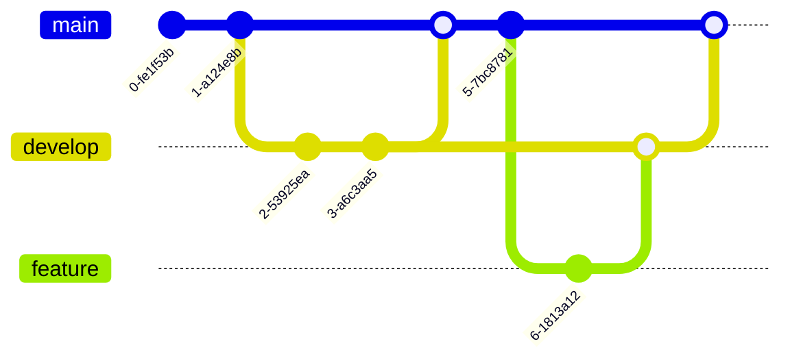

# Mermaid Diagram Guide

Mermaid is a JavaScript-based diagramming tool that renders markdown-inspired text definitions to create diagrams dynamically. This guide covers all diagram types supported in the blog.

## Basic Usage

To create a Mermaid diagram in your blog post, use a code block with the `mermaid` language tag:

````markdown

````

## Flowcharts

Flowcharts are the most common diagram type, perfect for showing processes and decision flows.

### Basic Flowchart

````markdown

````

### Direction Options

- `graph TD` - Top to bottom (default)
- `graph LR` - Left to right
- `graph BT` - Bottom to top
- `graph RL` - Right to left

### Node Shapes


### Arrow Types


## Sequence Diagrams

Perfect for showing interactions between systems or components over time.

````markdown

````

### Advanced Features


## Class Diagrams

Show object-oriented class structures and relationships.

````markdown

````

### Relationships

- `<|--` Inheritance
- `*--` Composition
- `o--` Aggregation
- `-->` Association
- `--` Link (solid)
- `..>` Dependency
- `..|>` Realization

### Visibility

- `+` Public
- `-` Private
- `#` Protected
- `~` Package/Internal

## State Diagrams

Show state machines and transitions.

````markdown

````

## Entity Relationship Diagrams

Perfect for database schema documentation.

````markdown

````

### Relationship Types

- `||--||` One to one
- `||--o{` One to many
- `}o--o{` Many to many
- `||..|{` One to many (optional)

### Attribute Keys

- `PK` Primary Key
- `FK` Foreign Key
- `UK` Unique Key

## Gantt Charts

Show project timelines and task dependencies.

````markdown

````

## Pie Charts

Simple data visualization.

````markdown

````

## Git Graphs

Visualize Git branching strategies.

````markdown

````

## Journey Diagrams

Show user journeys and experiences.

````markdown

````

## Styling and Theming

### Custom Styles


### Link Styles


## Best Practices

### 1. Keep It Simple

- Start with simple diagrams and add complexity as needed
- Use clear, descriptive labels
- Avoid overcrowding diagrams

### 2. Use Consistent Naming


### 3. Add Context with Notes


### 4. Group Related Items


## Common Use Cases for DevOps

### CI/CD Pipeline


### Infrastructure Architecture


### Incident Response Flow

```mermaid
stateDiagram-v2
    [*] --> Detected: Alert triggered
    Detected --> Acknowledged: On-call responds
    Acknowledged --> Investigating: Gather information
    Investigating --> Identified: Root cause found
    Identified --> Resolving: Apply fix
    Resolving --> Monitoring: Verify fix
    Monitoring --> Resolved: Confirmed stable
    Monitoring --> Investigating: Issue persists
    Resolved --> [*]
```

## Troubleshooting

### Diagram Not Rendering

1. **Check syntax**: Use [Mermaid Live Editor](https://mermaid.live) to validate
2. **Verify language tag**: Must be exactly `mermaid`
3. **Check for special characters**: Escape quotes and brackets properly
4. **Review error messages**: Check browser console for specific errors

### Common Syntax Errors

❌ **Wrong:**
````markdown
```mermaid
graph TD
    A[Node with "quotes"] --> B
```
````

✅ **Correct:**
````markdown
```mermaid
graph TD
    A["Node with quotes"] --> B
```
````

❌ **Wrong:**
````markdown
```mermaid
graph TD
    A --> B[Node
    with newline]
```
````

✅ **Correct:**
````markdown
```mermaid
graph TD
    A --> B["Node<br/>with newline"]
```
````

## Resources

- [Official Mermaid Documentation](https://mermaid.js.org/)
- [Mermaid Live Editor](https://mermaid.live) - Test diagrams online
- [Mermaid Cheat Sheet](https://jojozhuang.github.io/tutorial/mermaid-cheat-sheet/)
- [GitHub Mermaid Support](https://github.blog/2022-02-14-include-diagrams-markdown-files-mermaid/)

## Examples Repository

For more examples, see:
- `content/blog/feature-showcase.md` - Complete feature demonstration
- [Mermaid Examples](https://mermaid.js.org/ecosystem/integrations.html) - Official examples
